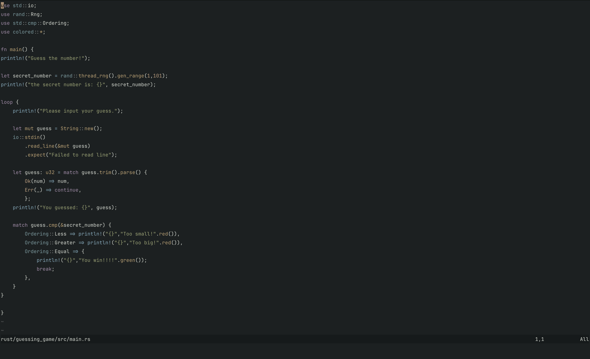

# Notch2k.nvim

A dark, muted colorscheme for Neovim inspired by the N0tch2k terminal theme. Designed for comfortable, extended coding sessions with a focus on readability and reduced eye strain.



## Features

- Dark muted color palette with a #1C2021 background
- Balanced, easy-on-the-eyes colors for long coding sessions
- Full support for:
  - Treesitter syntax highlighting
  - LSP diagnostics
  - Git highlighting
  - Telescope
  - NvimTree
  - Native terminal colors
- Designed to match the N0tch2k theme for Ghostty and other terminals

## Installation

### Using lazy.nvim

```lua
{
  "fuzztobread/notch2k.nvim",
  priority = 1000, -- Load before other plugins
  lazy = false,    -- Load during startup
  config = function()
    vim.cmd.colorscheme("notch2k")
  end,
}
```

### Using packer.nvim

```lua
use {
  'fuzztobread/notch2k.nvim',
  config = function()
    vim.cmd('colorscheme notch2k')
  end
}
```

### Using vim-plug

```vim
Plug 'fuzztobread/notch2k.nvim'
```

Then add to your configuration:

```vim
colorscheme notch2k
```

## Color Palette

Notch2k uses a carefully selected color palette designed for readability and comfort:

| Color | Hex | Usage |
|-------|-----|-------|
| Background | #1C2021 | Main background |
| Foreground | #D3D7CF | Main text |
| Gray | #929595 | Comments |
| Dark Gray | #5B5E5E | Subtle elements |
| Black | #161A1B | Contrast elements |
| Red | #A06D6D | Errors, warnings |
| Green | #9AA275 | Strings, success |
| Yellow | #BAA275 | Functions, highlights |
| Blue | #7D9BA0 | Identifiers, links |
| Magenta | #A08BA7 | Keywords, operators |
| Cyan | #88AABB | Special characters |
| White | #E0E5E5 | Bright highlights |
| Orange | #BB9F80 | Constants, numbers |
| Pink | #BB8099 | Special elements |

## Customization

You can override specific highlight groups in your Neovim configuration after loading the colorscheme:

```lua
-- After setting the colorscheme
vim.cmd('colorscheme notch2k')

-- Override specific highlight groups
vim.cmd('highlight Comment guifg=#888888')
vim.cmd('highlight LineNr guifg=#777777')
```

## Terminal Integration

For a consistent experience, you can use the N0tch2k theme in your terminal. This theme works especially well with Ghostty, Kitty, Alacritty, and other modern terminals.

## Inspiration

This colorscheme was inspired by the N0tch2k theme for terminals, with a focus on creating a consistent visual experience between terminal and editor. It's designed for developers who spend long hours coding and want a color palette that reduces eye strain while maintaining good syntax distinction.

## Contributing

Contributions are welcome! Feel free to submit issues or pull requests if you have suggestions for improvements.

## License

MIT
